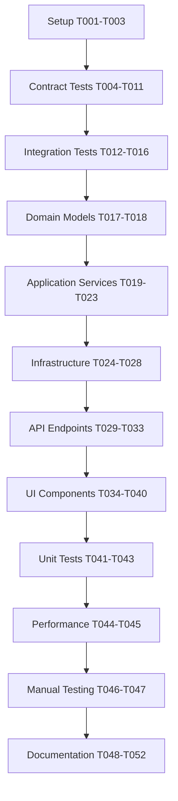

# Tasks: GDPR Compliance

**Input**: Design documents from `/Users/longfangsong/Projects/lass/specs/003-gdpr-compliance/`
**Prerequisites**: plan.md, research.md, data-model.md, contracts/, quickstart.md

## Execution Flow
```
1. Load plan.md → Extract tech stack (React 19, TypeScript 5.x, Vite, Cloudflare Workers)
2. Load data-model.md → Entities: UserDataExport (virtual), no new migrations
3. Load contracts/ → 4 API endpoints with format parameter for exports
4. Load quickstart.md → 8 user stories for integration tests
5. Generate tasks following TDD → Domain → Infrastructure → Application → API → UI
6. Apply parallel marking: Different files = [P], Same file = sequential
7. Validate: All contracts tested, all stories validated
```

## Format: `[ID] [P?] Description`
- **[P]**: Can run in parallel (different files, no dependencies)
- Paths shown are absolute from repository root

## Phase 3.1: Setup & Configuration
- [ ] **T001** Review existing Settings domain structure in `src/app/settings/` and API routes in `src/api/settings/`
- [ ] **T002** Verify no database migration needed (UserSettings table already exists)
- [ ] **T003** [P] Set up test utilities for contract testing in `tests/contract/privacy-api.test.ts`

## Phase 3.2: Tests First (TDD) ⚠️ MUST COMPLETE BEFORE 3.3
**CRITICAL: These tests MUST be written and MUST FAIL before ANY implementation**

### Contract Tests (Parallel)
- [ ] **T004** [P] Contract test GET /api/settings (normal retrieval) in `tests/contract/privacy-settings-get.test.ts`
- [ ] **T005** [P] Contract test GET /api/settings?format=json (export) in `tests/contract/privacy-settings-export-json.test.ts`
- [ ] **T006** [P] Contract test GET /api/settings?format=csv (export) in `tests/contract/privacy-settings-export-csv.test.ts`
- [ ] **T007** [P] Contract test DELETE /api/settings (account deletion) in `tests/contract/privacy-settings-delete.test.ts`
- [ ] **T008** [P] Contract test GET /api/word_book_entry (normal retrieval) in `tests/contract/privacy-wordbook-get.test.ts`
- [ ] **T009** [P] Contract test GET /api/word_book_entry?format=json (export) in `tests/contract/privacy-wordbook-export-json.test.ts`
- [ ] **T010** [P] Contract test GET /api/word_book_entry?format=csv (export) in `tests/contract/privacy-wordbook-export-csv.test.ts`
- [ ] **T011** [P] Contract test DELETE /api/word_book_entry (bulk deletion) in `tests/contract/privacy-wordbook-delete.test.ts`

### Integration Tests from User Stories (Parallel)
- [ ] **T012** [P] Integration test Story 1: First-time user sees consent banner in `tests/integration/consent-banner.test.ts`
- [ ] **T013** [P] Integration test Story 3: User views data summary in Settings in `tests/integration/view-data-summary.test.ts`
- [ ] **T014** [P] Integration test Story 4: User exports data (JSON) in `tests/integration/export-json.test.ts`
- [ ] **T015** [P] Integration test Story 5: User exports data (CSV) in `tests/integration/export-csv.test.ts`
- [ ] **T016** [P] Integration test Story 6: User deletes account in `tests/integration/delete-account.test.ts`

## Phase 3.3: Core Implementation (ONLY after tests are failing)

### Domain Models (Parallel)
- [ ] **T017** [P] Create UserDataExport TypeScript interface in `src/app/settings/domain/UserDataExport.ts`
- [ ] **T018** [P] Create export validation functions in `src/app/settings/domain/validation.ts`

### Application Services
- [ ] **T019** Export service: JSON serialization in `src/app/settings/application/exportService.ts` (method: exportAsJSON)
- [ ] **T020** Export service: CSV serialization in `src/app/settings/application/exportService.ts` (method: exportAsCSV)
- [ ] **T021** Deletion service: Settings deletion in `src/app/settings/application/deletionService.ts` (method: deleteUserSettings)
- [ ] **T022** Deletion service: Wordbook deletion in `src/app/settings/application/deletionService.ts` (method: deleteWordBookEntries)
- [ ] **T023** Data summary service in `src/app/settings/application/dataSummaryService.ts`

### Infrastructure (Database Queries)
- [ ] **T024** D1 query: Export settings data in `src/app/settings/infrastructure/queries.ts` (function: queryUserSettings)
- [ ] **T025** D1 query: Export wordbook entries with Word join in `src/app/settings/infrastructure/queries.ts` (function: queryWordBookEntries)
- [ ] **T026** D1 query: Delete settings in `src/app/settings/infrastructure/queries.ts` (function: deleteUserSettings)
- [ ] **T027** D1 query: Delete wordbook entries in `src/app/settings/infrastructure/queries.ts` (function: deleteWordBookEntries)
- [ ] **T028** D1 query: Data summary aggregation in `src/app/settings/infrastructure/queries.ts` (function: queryDataSummary)

### API Endpoints (Sequential - Shared Router)
- [ ] **T029** Extend GET /api/settings handler with optional format parameter in `src/api/settings/index.ts`
- [ ] **T030** Add DELETE /api/settings handler in `src/api/settings/index.ts`
- [ ] **T031** Extend GET /api/word_book_entry handler with optional format parameter in `src/api/word_book_entry/index.ts`
- [ ] **T032** Add DELETE /api/word_book_entry handler in `src/api/word_book_entry/index.ts`
- [ ] **T033** Add error handling middleware for privacy operations in `src/api/utils.ts`

## Phase 3.4: Presentation Layer (UI Components)

### Client-Side Components (Parallel after API complete)
- [ ] **T034** [P] ConsentBanner component (shows before login, client-only) in `src/app/shared/presentation/ConsentBanner.tsx`
- [ ] **T035** [P] PrivacyPanel component (Settings accordion section) in `src/app/settings/presentation/PrivacyPanel.tsx`
- [ ] **T036** [P] DataSummary component (shows user data overview) in `src/app/settings/presentation/DataSummary.tsx`
- [ ] **T037** [P] ExportDataModal component (format selector, download button) in `src/app/settings/presentation/ExportDataModal.tsx`
- [ ] **T038** [P] DeleteAccountModal component (confirmation input) in `src/app/settings/presentation/DeleteAccountModal.tsx`

### Route Integration
- [ ] **T039** Integrate ConsentBanner into app root layout in `src/app/main.tsx`
- [ ] **T040** Integrate PrivacyPanel into Settings page in `src/app/settings/presentation/SettingsPage.tsx`

## Phase 3.5: Polish & Validation

### Unit Tests (Parallel)
- [ ] **T041** [P] Unit tests for JSON/CSV serialization in `tests/unit/exportService.test.ts`
- [ ] **T042** [P] Unit tests for validation functions in `tests/unit/validation.test.ts`
- [ ] **T043** [P] Unit tests for D1 query builders in `tests/unit/queries.test.ts`

### Performance & Manual Testing
- [ ] **T044** Performance test: Export <1000 entries completes <200ms in `tests/performance/export.test.ts`
- [ ] **T045** Performance test: Deletion completes <500ms in `tests/performance/deletion.test.ts`
- [ ] **T046** Execute manual testing from `quickstart.md` - all 6 user stories
- [ ] **T047** Accessibility audit: Keyboard navigation, screen reader support for all new components

### Documentation & Cleanup
- [ ] **T048** [P] Update `.github/copilot-instructions.md` with final implementation details
- [ ] **T049** [P] Add JSDoc comments to all exported functions
- [ ] **T050** Remove any console.log debugging statements
- [ ] **T051** Run `pnpm run lint` and fix all warnings
- [ ] **T052** Run `pnpm run build` and verify production build succeeds

---

## Dependencies

### Critical Path
1. **Setup** (T001-T003) → All other phases
2. **Contract Tests** (T004-T011) → Domain models (T017-T018)
3. **Domain Models** (T017-T018) → Application services (T019-T023)
4. **Application Services** (T019-T023) → Infrastructure (T024-T028)
5. **Infrastructure** (T024-T028) → API endpoints (T029-T033)
6. **API Endpoints** (T029-T033) → UI components (T034-T040)
7. **UI Components** (T034-T040) → Integration tests pass (T012-T016)
8. **All Implementation** → Polish tasks (T041-T052)

### Sequential Dependencies (Same File)
- T029 → T030 (both edit `src/api/settings/index.ts`)
- T031 → T032 (both edit `src/api/word_book_entry/index.ts`)
- T019 → T020 (both edit `exportService.ts`)
- T021 → T022 (both edit `deletionService.ts`)
- T024 → T025 → T026 → T027 → T028 (all edit `queries.ts`)
- T039 → T040 (both integrate UI components)

### Parallel Groups

**Group 1: Contract Tests (T004-T011)**
```
Task: "Contract test GET /api/settings (normal retrieval) in tests/contract/privacy-settings-get.test.ts"
Task: "Contract test GET /api/settings?format=json (export) in tests/contract/privacy-settings-export-json.test.ts"
Task: "Contract test GET /api/settings?format=csv (export) in tests/contract/privacy-settings-export-csv.test.ts"
Task: "Contract test DELETE /api/settings (account deletion) in tests/contract/privacy-settings-delete.test.ts"
Task: "Contract test GET /api/word_book_entry (normal retrieval) in tests/contract/privacy-wordbook-get.test.ts"
Task: "Contract test GET /api/word_book_entry?format=json (export) in tests/contract/privacy-wordbook-export-json.test.ts"
Task: "Contract test GET /api/word_book_entry?format=csv (export) in tests/contract/privacy-wordbook-export-csv.test.ts"
Task: "Contract test DELETE /api/word_book_entry (bulk deletion) in tests/contract/privacy-wordbook-delete.test.ts"
```

**Group 2: Integration Tests (T012-T016)**
```
Task: "Integration test Story 1: First-time user sees consent banner in tests/integration/consent-banner.test.ts"
Task: "Integration test Story 3: User views data summary in Settings in tests/integration/view-data-summary.test.ts"
Task: "Integration test Story 4: User exports data (JSON) in tests/integration/export-json.test.ts"
Task: "Integration test Story 5: User exports data (CSV) in tests/integration/export-csv.test.ts"
Task: "Integration test Story 6: User deletes account in tests/integration/delete-account.test.ts"
```

**Group 3: Domain Models (T017-T018)**
```
Task: "Create UserDataExport TypeScript interface in src/app/settings/domain/UserDataExport.ts"
Task: "Create export validation functions in src/app/settings/domain/validation.ts"
```

**Group 4: UI Components (T034-T038)**
```
Task: "ConsentBanner component (shows before login, client-only) in src/app/shared/presentation/ConsentBanner.tsx"
Task: "PrivacyPanel component (Settings accordion section) in src/app/settings/presentation/PrivacyPanel.tsx"
Task: "DataSummary component (shows user data overview) in src/app/settings/presentation/DataSummary.tsx"
Task: "ExportDataModal component (format selector, download button) in src/app/settings/presentation/ExportDataModal.tsx"
Task: "DeleteAccountModal component (confirmation input) in src/app/settings/presentation/DeleteAccountModal.tsx"
```

**Group 5: Unit Tests (T041-T043)**
```
Task: "Unit tests for JSON/CSV serialization in tests/unit/exportService.test.ts"
Task: "Unit tests for validation functions in tests/unit/validation.test.ts"
Task: "Unit tests for D1 query builders in tests/unit/queries.test.ts"
```

**Group 6: Documentation (T048-T049)**
```
Task: "Update .github/copilot-instructions.md with final implementation details"
Task: "Add JSDoc comments to all exported functions"
```

---

## Task Execution Notes

### TDD Workflow (Red-Green-Refactor)
1. **Red**: Write failing test (e.g., T004)
2. **Green**: Implement minimal code to pass test (e.g., T029)
3. **Refactor**: Clean up code, remove duplication
4. **Commit**: After each task completion

### File Modification Tracking
- **Single-edit tasks**: T001-T003, T017-T018, T023, T024-T028 (queries.ts sequential), T029-T032 (API sequential), T034-T038, T039-T040
- **Multi-edit tasks**: None (all carefully separated by file)

### Validation Checklist
*GATE: Complete before marking phase done*

**After Phase 3.2 (Tests)**:
- [ ] All 8 contract tests exist and FAIL
- [ ] All 5 integration tests exist and FAIL
- [ ] No implementation code written yet

**After Phase 3.3 (Implementation)**:
- [ ] All contract tests PASS
- [ ] All domain models have corresponding tests
- [ ] All API endpoints match OpenAPI spec
- [ ] TypeScript compiles with no errors

**After Phase 3.4 (UI)**:
- [ ] All 5 UI components render without errors
- [ ] ConsentBanner appears on first visit
- [ ] PrivacyPanel accessible from Settings page

**After Phase 3.5 (Polish)**:
- [ ] All integration tests PASS
- [ ] Performance targets met (<200ms export, <500ms delete)
- [ ] `pnpm run lint` passes
- [ ] `pnpm run build` succeeds
- [ ] All 6 quickstart user stories validated manually

---

## Implementation Order Summary



**Total Tasks**: 52  
**Estimated Time**: 2-3 days for experienced developer  
**Parallel Opportunities**: 26 tasks marked [P] (50% parallelizable)

---

## Notes

- **No Database Migration**: Reuse existing UserSettings table, consent is implicit via account existence
- **RESTful Design**: Extend existing `/api/settings` and `/api/word_book_entry` with optional `format` parameter
- **Simplification**: No separate consent API endpoint - banner is client-side only
- **Performance**: Target <200ms for export, <500ms for bulk delete
- **Accessibility**: WCAG AA compliance for all new UI components
- **Testing**: TDD non-negotiable per project constitution

---

*Generated from Phase 2 task planning in plan.md*  
*Based on Constitution v2.1.1*
